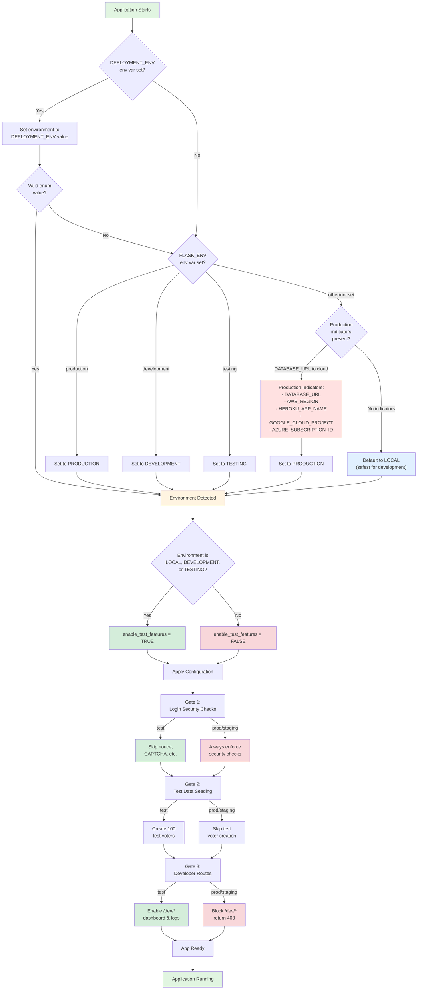
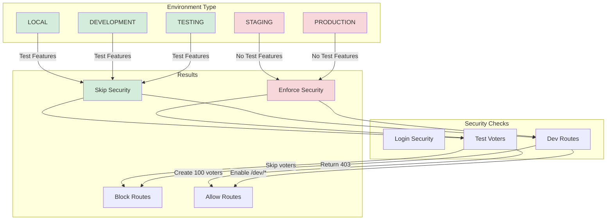
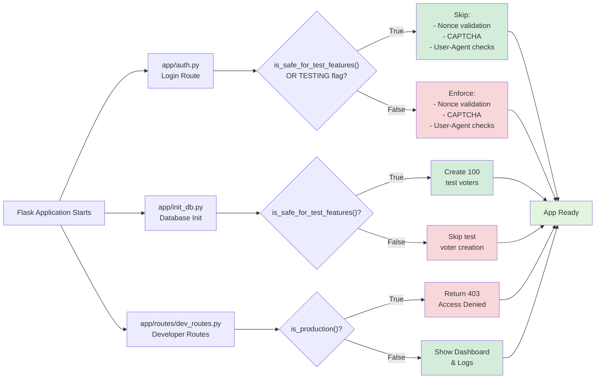
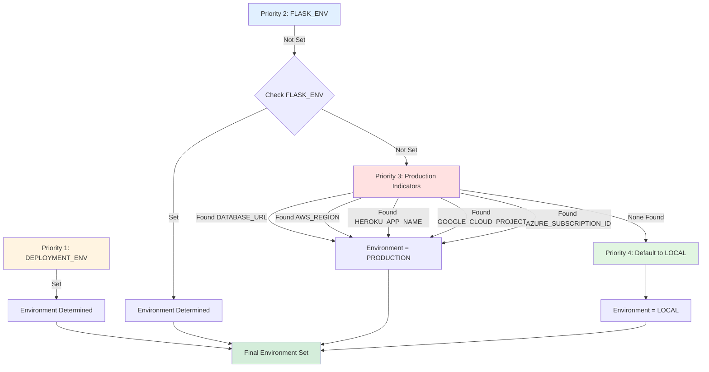

# Environment Detection Flow Diagram

```mermaid
flowchart TD
    START["Application Starts"] --> CHECK1{"DEPLOYMENT_ENV<br/>env var set?"}
    
    CHECK1 -->|Yes| SET_DEPLOYMENT["Set environment to<br/>DEPLOYMENT_ENV value"]
    SET_DEPLOYMENT --> VALID1{"Valid enum<br/>value?"}
    VALID1 -->|Yes| ENV_DETECTED["Environment Detected"]
    VALID1 -->|No| CHECK2
    
    CHECK1 -->|No| CHECK2{"FLASK_ENV<br/>env var set?"}
    
    CHECK2 -->|production| FLASK_PROD["Set to PRODUCTION"]
    FLASK_PROD --> ENV_DETECTED
    
    CHECK2 -->|development| FLASK_DEV["Set to DEVELOPMENT"]
    FLASK_DEV --> ENV_DETECTED
    
    CHECK2 -->|testing| FLASK_TEST["Set to TESTING"]
    FLASK_TEST --> ENV_DETECTED
    
    CHECK2 -->|other/not set| CHECK3
    
    CHECK3{"Production<br/>indicators<br/>present?"}
    
    CHECK3 -->|DATABASE_URL to cloud| PROD_INDICATOR["Production Indicators:<br/>- DATABASE_URL<br/>- AWS_REGION<br/>- HEROKU_APP_NAME<br/>- GOOGLE_CLOUD_PROJECT<br/>- AZURE_SUBSCRIPTION_ID"]
    PROD_INDICATOR --> SET_PROD["Set to PRODUCTION"]
    SET_PROD --> ENV_DETECTED
    
    CHECK3 -->|No indicators| DEFAULT["Default to LOCAL<br/>(safest for development)"]
    DEFAULT --> ENV_DETECTED
    
    ENV_DETECTED --> DETERMINE_SAFETY{"Environment is<br/>LOCAL, DEVELOPMENT,<br/>or TESTING?"}
    
    DETERMINE_SAFETY -->|Yes| ENABLE_TESTS["enable_test_features = TRUE"]
    DETERMINE_SAFETY -->|No| DISABLE_TESTS["enable_test_features = FALSE"]
    
    ENABLE_TESTS --> APPLY["Apply Configuration"]
    DISABLE_TESTS --> APPLY
    
    APPLY --> GATE1["Gate 1:<br/>Login Security Checks"]
    GATE1 --> |test| SKIP_LOGIN["Skip nonce,<br/>CAPTCHA, etc."]
    GATE1 --> |prod/staging| ENFORCE_LOGIN["Always enforce<br/>security checks"]
    
    SKIP_LOGIN --> GATE2["Gate 2:<br/>Test Data Seeding"]
    ENFORCE_LOGIN --> GATE2
    
    GATE2 --> |test| CREATE_VOTERS["Create 100<br/>test voters"]
    GATE2 --> |prod/staging| SKIP_VOTERS["Skip test<br/>voter creation"]
    
    CREATE_VOTERS --> GATE3["Gate 3:<br/>Developer Routes"]
    SKIP_VOTERS --> GATE3
    
    GATE3 --> |test| ENABLE_DEV["Enable /dev/*<br/>dashboard & logs"]
    GATE3 --> |prod/staging| DISABLE_DEV["Block /dev/*<br/>return 403"]
    
    ENABLE_DEV --> READY["App Ready"]
    DISABLE_DEV --> READY
    
    READY --> END["Application Running"]
    
    style START fill:#e1f5e1
    style END fill:#e1f5e1
    style ENV_DETECTED fill:#fff4e1
    style PROD_INDICATOR fill:#ffe1e1
    style DEFAULT fill:#e1f0ff
    style ENABLE_TESTS fill:#d4edda
    style DISABLE_TESTS fill:#f8d7da
    style ENFORCE_LOGIN fill:#f8d7da
    style SKIP_LOGIN fill:#d4edda
    style DISABLE_DEV fill:#f8d7da
    style ENABLE_DEV fill:#d4edda
```

# Safety Decision Matrix

```mermaid
graph TB
    subgraph "Environment Type"
        LOCAL["LOCAL"]
        DEV["DEVELOPMENT"]
        TEST["TESTING"]
        STAGING["STAGING"]
        PROD["PRODUCTION"]
    end
    
    subgraph "Security Checks"
        LOGIN["Login Security"]
        VOTERS["Test Voters"]
        DEVROUTES["Dev Routes"]
    end
    
    subgraph "Results"
        SKIP_ALL["Skip Security"]
        ENFORCE_ALL["Enforce Security"]
        BLOCK_DEV["Block Routes"]
        ALLOW_DEV["Allow Routes"]
    end
    
    LOCAL --> |Test Features| SKIP_ALL
    DEV --> |Test Features| SKIP_ALL
    TEST --> |Test Features| SKIP_ALL
    
    STAGING --> |No Test Features| ENFORCE_ALL
    PROD --> |No Test Features| ENFORCE_ALL
    
    SKIP_ALL --> VOTERS
    SKIP_ALL --> DEVROUTES
    
    ENFORCE_ALL --> VOTERS
    ENFORCE_ALL --> DEVROUTES
    
    VOTERS --> |Create 100 voters| ALLOW_DEV
    VOTERS --> |Skip voters| BLOCK_DEV
    DEVROUTES --> |Enable /dev/*| ALLOW_DEV
    DEVROUTES --> |Return 403| BLOCK_DEV
    
    style LOCAL fill:#d4edda
    style DEV fill:#d4edda
    style TEST fill:#d4edda
    style STAGING fill:#f8d7da
    style PROD fill:#f8d7da
    style SKIP_ALL fill:#d4edda
    style ENFORCE_ALL fill:#f8d7da
```

# Integration Points

```mermaid
flowchart LR
    APP["Flask Application Starts"]
    
    APP --> AUTH["app/auth.py<br/>Login Route"]
    APP --> INIT["app/init_db.py<br/>Database Init"]
    APP --> DEV["app/routes/dev_routes.py<br/>Developer Routes"]
    
    AUTH --> AUTH_CHECK{"is_safe_for_test_features()<br/>OR TESTING flag?"}
    AUTH_CHECK -->|True| AUTH_SKIP["Skip:<br/>- Nonce validation<br/>- CAPTCHA<br/>- User-Agent checks"]
    AUTH_CHECK -->|False| AUTH_ENFORCE["Enforce:<br/>- Nonce validation<br/>- CAPTCHA<br/>- User-Agent checks"]
    
    INIT --> INIT_CHECK{"is_safe_for_test_features()?"}
    INIT_CHECK -->|True| INIT_CREATE["Create 100<br/>test voters"]
    INIT_CHECK -->|False| INIT_SKIP["Skip test<br/>voter creation"]
    
    DEV --> DEV_CHECK{"is_production()?"}
    DEV_CHECK -->|True| DEV_BLOCK["Return 403<br/>Access Denied"]
    DEV_CHECK -->|False| DEV_ALLOW["Show Dashboard<br/>& Logs"]
    
    AUTH_SKIP --> READY["App Ready"]
    AUTH_ENFORCE --> READY
    INIT_CREATE --> READY
    INIT_SKIP --> READY
    DEV_BLOCK --> READY
    DEV_ALLOW --> READY
    
    style AUTH_SKIP fill:#d4edda
    style AUTH_ENFORCE fill:#f8d7da
    style INIT_CREATE fill:#d4edda
    style INIT_SKIP fill:#f8d7da
    style DEV_ALLOW fill:#d4edda
    style DEV_BLOCK fill:#f8d7da
    style READY fill:#e1f5e1
```

# Configuration Priority

```mermaid
flowchart TD
    P1["Priority 1: DEPLOYMENT_ENV"]
    P2["Priority 2: FLASK_ENV"]
    P3["Priority 3: Production Indicators"]
    P4["Priority 4: Default to LOCAL"]
    
    P1 --> |Set| RESULT1["Environment Determined"]
    P2 --> |Not Set| CHECK2{"Check FLASK_ENV"}
    CHECK2 --> |Set| RESULT2["Environment Determined"]
    CHECK2 --> |Not Set| P3
    
    P3 --> |Found DATABASE_URL| RESULT3["Environment = PRODUCTION"]
    P3 --> |Found AWS_REGION| RESULT3
    P3 --> |Found HEROKU_APP_NAME| RESULT3
    P3 --> |Found GOOGLE_CLOUD_PROJECT| RESULT3
    P3 --> |Found AZURE_SUBSCRIPTION_ID| RESULT3
    P3 --> |None Found| P4
    
    P4 --> RESULT4["Environment = LOCAL"]
    
    RESULT1 --> FINAL["Final Environment Set"]
    RESULT2 --> FINAL
    RESULT3 --> FINAL
    RESULT4 --> FINAL
    
    style P1 fill:#fff4e1
    style P2 fill:#e1f0ff
    style P3 fill:#ffe1e1
    style P4 fill:#e1f5e1
    style FINAL fill:#d4edda
```

