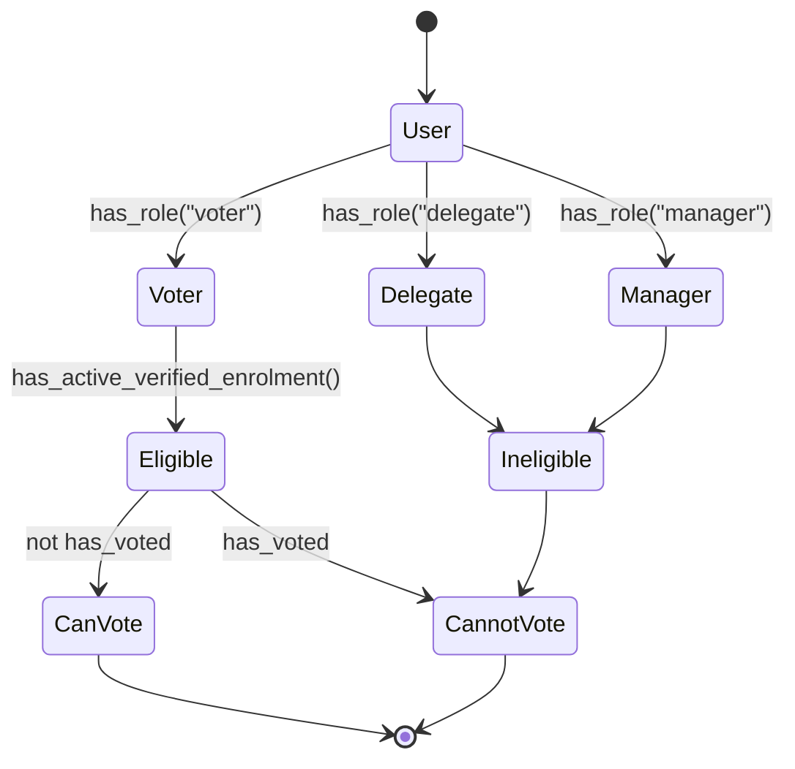
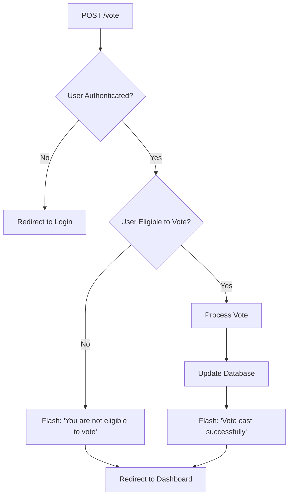
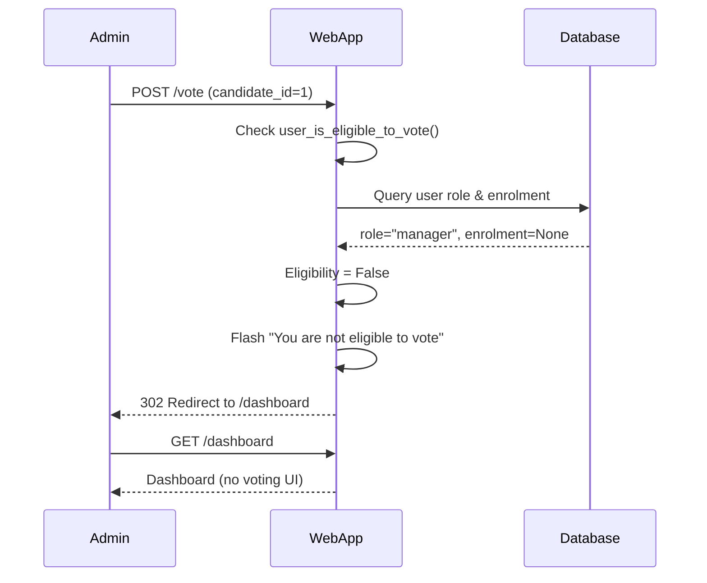
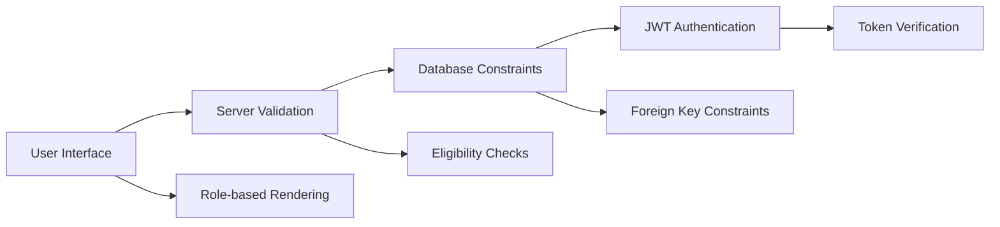

# Admin Voting Prevention

## Overview

This document describes how the voting system prevents administrators from voting, ensuring the integrity of the electoral process. Administrators (users with "manager" role) are completely excluded from voting functionality at both the UI and API levels.

## Security Design

The system implements a multi-layered approach to prevent admin voting:

1. **UI Layer**: Voting interface is conditionally rendered based on user role
2. **API Layer**: Server-side eligibility validation before processing votes
3. **Database Layer**: Role-based access control enforced at the data model level

## User Roles and Voting Eligibility



## Voting Eligibility Function

The core eligibility check is implemented in `user_is_eligible_to_vote()`:

```python
def user_is_eligible_to_vote(user):
    enrol = getattr(user, "enrolment", None)
    return (
        user.has_role("voter")           # Must have voter role
        and not user.has_voted            # Must not have voted yet
        and enrol is not None             # Must have electoral roll entry
        and enrol.status == "active"      # Roll must be active
        and enrol.verified                # Roll must be verified
    )
```

## UI-Level Prevention

### Dashboard Template Logic

The main dashboard (`dashboard.html`) only shows voting controls to eligible voters:

```html

<div class="row">
    
    <div class="col-md-4 mb-3">
        <div class="card">
            <!-- Vote button for each candidate -->
            <form method="POST" action="{{ url_for('main.vote') }}">
                <input type="hidden" name="candidate_id" value="{{ candidate.id }}">
                <button type="submit" class="btn btn-primary">Vote for {{ candidate.name }}</button>
            </form>
        </div>
    </div>
    
</div>

```

### Admin Dashboard

Administrators see the delegate dashboard (`delegates_dashboard.html`) which contains candidate management tools but no voting interface.

## API-Level Prevention

### Vote Route Protection

The `/vote` endpoint implements server-side validation:



### Vote Processing Flow



## Test Coverage

### Integration Tests

The system includes comprehensive test coverage for admin voting prevention:

```python
def test_admin_cannot_vote(self, clean_session):
    """Test admin cannot vote (only voters can)."""
    clean_session.login('admin', 'admin123')

    # Try to vote
    response = clean_session.post('/vote', data={'candidate_id': 1}, allow_redirects=False)

    # Should redirect to dashboard with ineligibility message
    assert response.status_code == 302
    assert 'dashboard' in response.headers.get('Location', '')
```

### Test Results

- ✅ Admin login succeeds
- ✅ Vote attempt returns 302 redirect (not 200)
- ✅ Redirect location contains 'dashboard'
- ✅ No voting UI displayed on admin dashboard

## Security Implications

### Attack Vectors Mitigated

1. **UI Bypass**: Direct API calls are blocked by server-side checks
2. **Role Escalation**: Database constraints prevent role changes that could enable voting
3. **Session Manipulation**: JWT tokens include user ID, preventing impersonation
4. **Database Injection**: Parameterized queries prevent SQL injection

### Defense in Depth



## Database Schema

### User-Role Relationship

```sql
-- Users have roles that determine voting eligibility
CREATE TABLE user (
    id INTEGER PRIMARY KEY,
    username VARCHAR(80) UNIQUE,
    role_id INTEGER REFERENCES roles(id),
    has_voted BOOLEAN DEFAULT FALSE
);

-- Roles define permissions
CREATE TABLE roles (
    id INTEGER PRIMARY KEY,
    name VARCHAR(50) UNIQUE,  -- 'voter', 'delegate', 'manager'
    description VARCHAR(255)
);
```

### Electoral Roll

```sql
-- Only voters have verified electoral roll entries
CREATE TABLE electoral_roll (
    id INTEGER PRIMARY KEY,
    user_id INTEGER UNIQUE REFERENCES user(id),
    status ENUM('active', 'suspended', 'removed'),
    verified BOOLEAN DEFAULT FALSE,
    -- ... other fields
);
```

## Configuration

### MFA Settings

The system supports optional Multi-Factor Authentication:

```python
# In app/__init__.py
ENABLE_MFA = os.environ.get('ENABLE_MFA', 'False').lower() in ('true', '1', 'yes')
```

When MFA is disabled (default for testing), admins can log in directly. When enabled, they must complete OTP verification.

## Conclusion

The admin voting prevention system provides robust protection through:

- **UI-level filtering** prevents voting interface display
- **API-level validation** blocks unauthorized vote attempts
- **Database-level constraints** enforce role-based access
- **Comprehensive testing** ensures functionality works as designed

This multi-layered approach ensures that administrators cannot vote while maintaining system usability for legitimate voters.